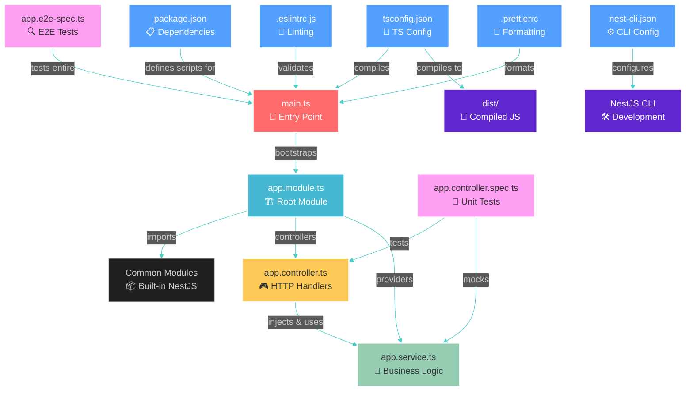

# NestJS Fundamentals

A comprehensive guide to creating, structuring, and understanding NestJS applications with best practices.

## 🌟 What is NestJS?

NestJS is a progressive Node.js framework for building efficient, reliable, and scalable server-side applications. It uses TypeScript by default and combines elements of:

- **OOP** (Object Oriented Programming)
- **FP** (Functional Programming)
- **FRP** (Functional Reactive Programming)

## 🚀 Installation & Setup

### Prerequisites

```bash
# Install Node.js (version 16 or higher)
# Install npm, yarn, or pnpm
```

### Global CLI Installation

```bash
npm i -g @nestjs/cli
# or
yarn global add @nestjs/cli
```

## 🎯 Project Creation

### Step 1: Create New Project

```bash
# Create new project with name my-nestjs-app
nest new my-nestjs-app

# Create new project in this folder
nest new .

# With specific package manager
nest new my-nestjs-app --package-manager npm
nest new my-nestjs-app --package-manager yarn
nest new my-nestjs-app --package-manager pnpm

# Skip Git initialization
nest new my-nestjs-app --skip-git

# Skip package installation
nest new my-nestjs-app --skip-install
```

### Step 2: Navigate to Project

```bash
cd my-nestjs-app
```

## 📂 File Structure Overview

### Initial Project Structure

After running `nest new`, you'll get this basic structure:

```text
my-nestjs-app/
├── src/                          # 📂 Source code
│   ├── app.controller.spec.ts    # 🧪 Unit tests for controller
│   ├── app.controller.ts         # 🎮 HTTP request handlers
│   ├── app.module.ts             # 🏗️ Root module (app structure)
│   ├── app.service.ts            # 🔧 Business logic
│   └── main.ts                   # 🚀 Application entry point
├── test/                         # 🧪 End-to-end tests
│   ├── app.e2e-spec.ts          # E2E test file
│   └── jest-e2e.json            # E2E test configuration
├── node_modules/                 # 📦 Dependencies (auto-generated)
├── dist/                         # 📁 Compiled JavaScript (after build)
├── .eslintrc.js                  # 📏 ESLint configuration
├── .gitignore                    # 🚫 Git ignore patterns
├── .prettierrc                   # 💅 Code formatting rules
├── nest-cli.json                 # ⚙️ Nest CLI configuration
├── package.json                  # 📋 Project dependencies & scripts
├── package-lock.json             # 🔒 Exact dependency versions
├── README.md                     # 📖 Project documentation
├── tsconfig.build.json           # 🔨 TypeScript build config
└── tsconfig.json                 # 📝 TypeScript configuration
```

## 📊 File Connections Diagram



## 📝 File-by-File Explanation

### 🚀 `src/main.ts` - Application Entry Point

```tsx
import { NestFactory } from '@nestjs/core';
import { AppModule } from './app.module';

async function bootstrap() {
  const app = await NestFactory.create(AppModule);
  await app.listen(3000);
}
bootstrap();
```

**Purpose:**

- **Entry point** of your entire application
- Creates the NestJS application instance
- Starts the HTTP server on port 3000
- **Bootstraps** the root module (`AppModule`)

### 🏗️ `src/app.module.ts` - Root Module

```tsx
import { Module } from '@nestjs/common';
import { AppController } from './app.controller';
import { AppService } from './app.service';

@Module({
  imports: [],
  controllers: [AppController],
  providers: [AppService],
})
export class AppModule {}
```

**Purpose:**

- **Root module** that organizes your entire application
- Defines the application structure
- **Central hub** that connects controllers and services

### 🎮 `src/app.controller.ts` - HTTP Request Handler

```tsx
import { Controller, Get } from '@nestjs/common';
import { AppService } from './app.service';

@Controller()
export class AppController {
  constructor(private readonly appService: AppService) {}

  @Get()
  getHello(): string {
    return this.appService.getHello();
  }
}
```

**Purpose:**

- Handles **incoming HTTP requests**
- Defines **API endpoints** (routes)
- **Delegates business logic** to services

### 🔧 `src/app.service.ts` - Business Logic

```tsx
import { Injectable } from '@nestjs/common';

@Injectable()
export class AppService {
  getHello(): string {
    return 'Hello World!';
  }
}
```

**Purpose:**

- Contains **business logic**
- Reusable across multiple controllers
- **Single responsibility** - does one thing well

## Path Mapping Configuration

Add path mapping to your `tsconfig.json` for cleaner imports:

```json
{
  "compilerOptions": {
    "baseUrl": "./",
    "paths": {
      "@/*": ["src/*"],
      "@/common/*": ["src/common/*"],
      "@/modules/*": ["src/modules/*"],
      "@/libs/*": ["src/libs/*"],
      "@/shared/*": ["src/shared/*"]
    }
  }
}
```

Then use clean imports:

```tsx
// Instead of: import { UserEntity } from '../../../database/entities/user.entity';
import { UserEntity } from '@/database/entities/user.entity';

// Instead of: import { ApiResponse } from '../../common/interfaces/api-response';
import { ApiResponse } from '@/common/interfaces/api-response';
```
