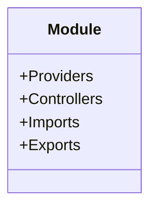
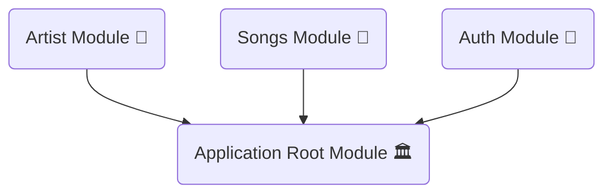
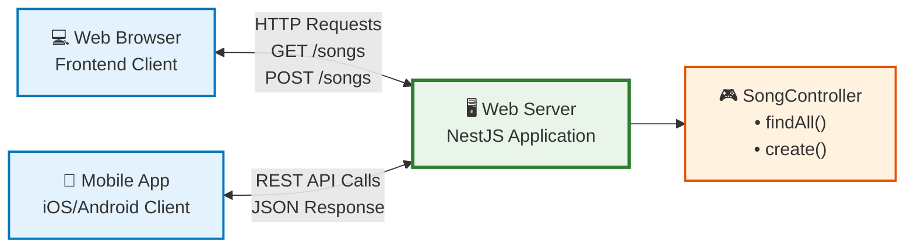
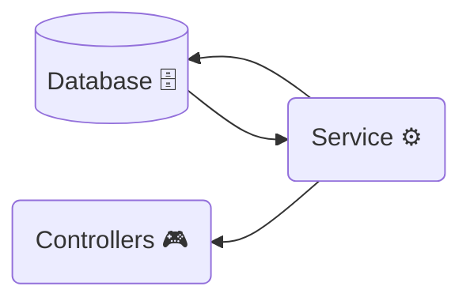

# Creating REST APIs

## **What is a module in Nest.js**



**_A module serves as the foundational building block of a Nest.js application, adhering to the Nest.js principle of modularity for better code organization._** Each Module encapsulates Providers, Controllers, Imports, and Exports, acting as a cohesive unit of related functionality.

- **Providers** in Nest.js are classes that act as services, factories, or repositories. They encapsulate business logic and can be injected into controllers or other services.
- **Controllers** serve the function of handling incoming HTTP requests and sending responses back to the client, aligning with the Nest.js use of the controller pattern for request handling.
- **Imports** is an array that specifies the external modules needed for the current module, enabling code reusability and separation of concerns.
- **Exports** are utilized to make services available to other modules, aligning with the Nest.js emphasis on encapsulation and modular design.

Your application will contain a Root Module, which is specific to the Nest.js framework. The Root Module serves as the entry point and is responsible for instantiating controllers, providers, and other core elements of the application. In Nest.js, this architecture follows the `Module Isolation` principle, ensuring that the application is organized into distinct functional or feature-based modules.

`app.module.ts`

```tsx
@Module({
  imports: [SongsModule],
  controllers: [AppController],
  providers: [AppService],
})
export class AppModule {}
```

We are going to build the backend of the Spotify application. We can divide our application into Modules in this way



Divide your application’s use cases into feature modules, such as the Artist Module, Songs Module, and Auth Module. In Nest.js, modules are a fundamental organizational unit that follow the Modularization principle, enabling better code reusability and separation of concerns. This approach streamlines development, as modules encapsulate related functionalities and can be developed or maintained independently.

Each Module will have its own providers, services, and controllers.

Now it’s time to **create a module**. Create a songs module using nest cli

```tsx
nest g module songs
```

A songs module will be created in your application. It will also add the `SongsModule` entry in `AppModule`

## What is a Nest.js Controller



**_Controllers in Nest.js are responsible for handling incoming requests and managing the logic to send responses back to the client. They act as the `“C”` in the `MVC (Model-View-Controller)` pattern that Nest.js leverages for application architecture._**

In the context of building the backend of a Spotify-like application, let’s say you want to fetch all songs by the artist Martin Garrix. The responsibility to handle this type of request lies primarily with controllers, specific to this use case— the `SongsController`.

Your browser will initiate a request to fetch all songs. In your Nest.js application,
you’ll handle this through the `SongsController` and its `findAll` method, which is specifically designed to interact with underlying services to retrieve data and send it back to the client.

**Create these endpoints in the application.**

- GET <http://localhost:3000/songs>
- GET <http://localhost:3000/songs/1>
- POST <http://localhost:3000/songs>
- PUT <http://localhost:3000/songs/1>
- DELETE <http://localhost:3000/songs/1>

You can create a controller very easily. We are going to use the Nest cli to **create a controller**

```bash
nest g controller songs
```

Have the `SongsController` inside the songs directory. `Nestjs` will also added the entry for the `SongsController` in `SongsModule`.

### **Create these endpoints in the controller**

`songs.controller.ts`

```tsx
import { Controller, Delete, Get, Post, Put } from '@nestjs/common';

@Controller('songs')
export class SongsController {
  @Post()
  create() {
    return 'create a new song endpoint';
  }

  @Get()
  findAll() {
    return 'find all songs endpoint';
  }
  @Get(':id')
  find() {
    return 'fetch song on the based on id';
  }

  @Put(':id')
  update() {
    return 'update song on the based on id';
  }

  @Delete(':id')
  delete() {
    return 'delete song on the based on id';
  }
}
```

We’re sending simple messages to indicate that the route has been created. In Nest.js, you can specify dynamic parameters `id=1` in your route by using a colon followed by the parameter name, like `@Get(':id')`. This follows the Nest.js principle of utilizing decorators to handle common HTTP tasks, streamlining the codebase and making it more readable.

## What is Service

Services in `Nest.js` are providers, meaning you can inject them into modules and classes through dependency injection. In Nest.js, a service is not just a construct but a first-class citizen, managed by the framework’s built-in `Inversion of Control (IoC)` container. Unlike in `Express.js`, where middleware or simple JavaScript functions often serve the same purpose but without formal dependency management, Nest.js services offer a structured way to write business logic, making the application more maintainable and testable.



**_A service in Nest.js is responsible for fetching data from the database and saving data back to the database, functioning as a liaison between the controller and the database._** This concept aligns with `Nest.js`’s adherence to the Single Responsibility Principle, separating the business logic from the controller layer, a stark contrast to `Express.js` where the roles are often less clearly delineated.

A service can be injected into a controller using `Nest.js`’s built-in Dependency Injection system. You can also export the service from the current module, enabling its use in other parts of that specific module. This is another feature where Nest.js differentiates itself from frameworks like Express.js, offering native support for modularity and code reuse through its export system.

In this lesson, we’ll focus on creating the song service, a specific component tailored to manage song-related data. Creating specialized services for different aspects of your application promotes better maintainability and is a cornerstone of `Nest.js`’s modular architecture.

### **Creating a Service by using nest-cli**

```tsx
nest g service songs
```

This command will create the `SongsService` inside the songs folder. One more thing, It will register the `SongsService` into `SongsModule` in the provider array

`songs.module.ts`

```tsx
@Module({
  controllers: [SongsController],
  providers: [SongsService],
})
export class SongsModule {}
```

Let’s create an array of songs and this service will interact with the songs array. We will interact with the database next section.

`songs.service.ts`

```tsx
import { Injectable } from '@nestjs/common';

@Injectable()
export class SongsService {
  // local database -> array
  private readonly songs: unknown[] = [];

  create(song) {
    // save the song in the database
    this.songs.push(song);
    return this.songs;
  }

  findAll() {
    // fetch the songs from the database
    return this.songs;
  }
}
```

Now a songs array has been created and two methods: `create`and `findAll`.

- Use `findAll` to send the array of songs in the response. In `Nest.js`, this is a common use case for a `GET` request handler within a controller, and it’s more declarative compared to handling routes in `Express.js`, which often requires middleware for such functionality.
- Utilize create to add new `songs` to the array. This aligns with `Nest.js`’s design philosophy of structuring code around well-defined modules and services, as
  opposed to Express’s more flexible but less structured approach.

### **Inject the Service into the Controller**

Use the `SongsService` within the `SongsController`. In `Nest.js`, this demonstrates the Dependency Injection (`DI`) system, which is a fundamental principle of the framework for decoupling components. Unlike in `Express.js`, where middleware and route handling functions often mingle with business logic, `Nest.js` encourages a more structured, modular approach that aligns well with `SOLID` principles

`songs.controller.ts`

```tsx
export class SongsController {
  constructor(private songsService: SongsService) {}

  @Post()
  create() {
    return this.songsService.create('Animals by Martin Garrix');
  }
}
```

**Call the the create method from `SongService`.**

## Test Routes

- **Test the `GET` Songs Route:** Run the application and send a `GET` request to [`http://localhost:3000/songs](http://localhost:3000/songs).`This API request will return all the songs; if no items are present in the songs array, expect a`[]` response with a 200 status code. Unlike in Express, where you would manually define the response code and body, Nest.js leverages decorators and dependency injection to streamline API response management.
- **Test the `POST` Songs Route:** When you send this **`POST`** request [`http://localhost:3000/songs`](http://localhost:3000/songs) from rest-client. It will create a new song in the songs array.

When you send the get songs request again you will get the songs array in the response.
`["Animals by Martin Garrix"];`

---

> **Shortcut command**
>
> Make `module`, `controller`, and `service` using one command
>
> ```bash
> nest g module songs; nest g controller songs; nest g service songs
> ```
