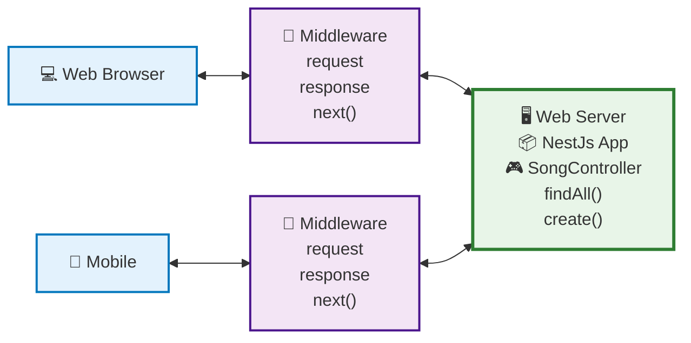
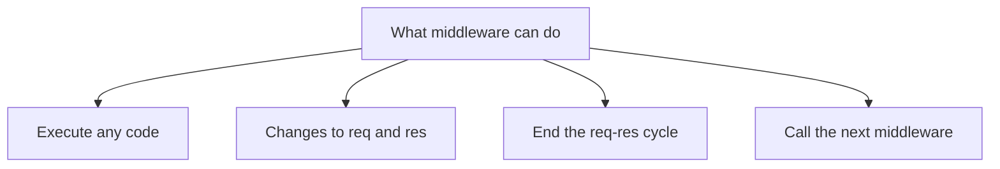
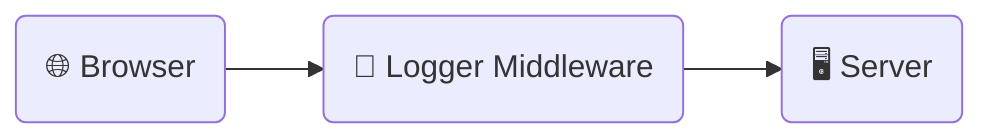

# Middleware, Exception Filters and Pipes

## Middleware

### What is Middleware in Nest.js



Execute a middleware function before running the route handler; for example, run it before the `findAll` method in `SongsController`. In contrast to frameworks like Express, Nest.js middleware offers a more organized and modular approach, closely aligning with object-oriented programming and functional programming paradigms.

The middleware will have access to `req`, `res`, and the `next` function, allowing customization of the request object. This is similar to Express, but Nest.js provides a more robust and scalable architecture for building complex applications.

### Middleware can do—



- **Execute any code within middleware**
  In Nest.js, middleware is similar to the Express.js middleware but is more class-based and modular, fitting well within Nest’s strong modular architecture. Unlike in Express, where middleware can sometimes become unmanageable in large applications, Nest.js provides a more structured way to handle middleware.
- **Modify the request `(req)` object**
  In traditional Express.js, this is often done directly within the middleware function. In Nest.js, however, you can lean more on Dependency Injection `(DI)` and modularity to make these changes in a more organized fashion.
- **End the response cycle**
  Just like in Express, middleware in Nest.js can terminate the request-response cycle. However, Nest.js middleware leverages `async/await` and decorators, offering a more modern approach and cleaner syntax for handling such operations.
- **Call the next middleware in the stack.**
  Both in Nest.js and Express, middleware can pass control to the next middleware function in the stack using the `next()` function. However, Nest.js brings type safety and DI into the picture, making it easier to build robust and maintainable applications.

### Logger Middleware



Send the request to the server via a browser. In the Nest.js application, execute the logger middleware before running the request handler. This architecture follows `Nest.js`’s modular approach, wherein middleware-like logging functions can be organized and re-used across different modules more effectively than in a framework like Express, which lacks such a built-in modular system.

Logger systems are essential for tracking activity, diagnosing issues, and understanding the behavior of an application. Unlike traditional setups where logging might be an afterthought, Nest.js allows the integration of sophisticated logging mechanisms due to its modular and extensible nature. This is in contrast to less opinionated frameworks like Express, where logging is often implemented via external middleware without any standard structure.

### **Creating Logger Middleware**

We are going to use nest cli to generate the `LoggerMiddleware`. Please create the common folder inside the `src` directory and also create a `middleware` folder inside the common directory. This could be the directory structure `src/common/middleware/`

```bash
nest g mi shared/interceptors/logger --no-spec --flat
```

$Notes:$

- `--no-spec` means I don’t want the testing file
- `--flat` means do not create the new directory with logger middleware. You have to create the `logger.middleware.ts` file

You will the `logger.middleware.ts` inside the middleware folder.

`logger.middleware.ts`

```tsx
import { Injectable, Logger, NestMiddleware } from '@nestjs/common';
import { NextFunction, Request, Response } from 'express';

@Injectable()
export class LoggerMiddleware implements NestMiddleware {
  private logger = new Logger('HTTP');

  use(req: Request, res: Response, next: NextFunction): void {
    const { ip, method, originalUrl } = req;
    const userAgent = req.get('User-Agent') || '';

    res.on('close', () => {
      const { statusCode } = res;
      const contentLength = res.get('Content-Length');

      this.logger.log(
        `${method} ${originalUrl} ${statusCode} ${contentLength} - ${userAgent} ${ip}`,
      );
    });

    next();
  }
}
```

Create a `LoggerMiddleware` class that implements `NestMiddleware`. Ensure you write the implementation for the use method. Customize the req object as needed; for example, you could log the current date.

### **Apply middleware.**

`app.module.ts`

```tsx
export class AppModule implements NestModule {
  configure(consumer: MiddlewareConsumer) {
    // Option No: 1. Specific path
    // consumer.apply(LoggerMiddleware).forRoutes('songs');

    // Option No: 2. Specific path & method
    // consumer
    //   .apply(LoggerMiddleware)
    //   .forRoutes({ path: 'songs', method: RequestMethod.POST });

    // Option No: 3. Specific Controller
    consumer.apply(LoggerMiddleware).forRoutes(SongsController);
  }
}
```

### **Test the middleware**

- Start the application using `npm run start:dev`.
- When sending a request to any songs API route, ensure it displays the current date.
- Send a `GET` request to `localhost:3000/songs`.
