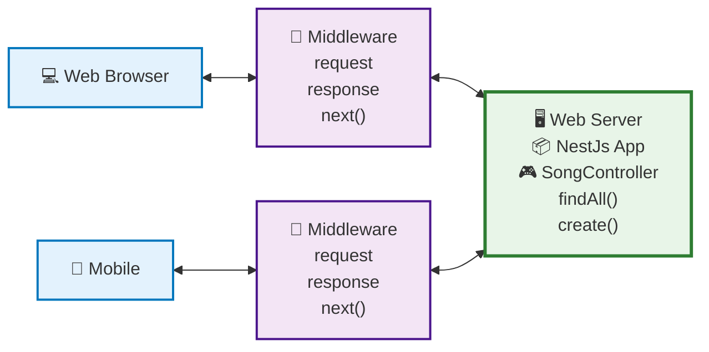
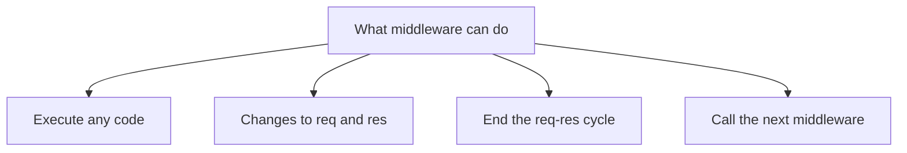

# Middleware, Exception Filters and Pipes

## Middleware

### What is Middleware in Nest.js



Execute a middleware function before running the route handler; for example, run it before the `findAll` method in `SongsController`. In contrast to frameworks like Express, Nest.js middleware offers a more organized and modular approach, closely aligning with object-oriented programming and functional programming paradigms.

The middleware will have access to `req`, `res`, and the `next` function, allowing customization of the request object. This is similar to Express, but Nest.js provides a more robust and scalable architecture for building complex applications.

### Middleware can do—



- **Execute any code within middleware**
  In Nest.js, middleware is similar to the Express.js middleware but is more class-based and modular, fitting well within Nest’s strong modular architecture. Unlike in Express, where middleware can sometimes become unmanageable in large applications, Nest.js provides a more structured way to handle middleware.
- **Modify the request `(req)` object**
  In traditional Express.js, this is often done directly within the middleware function. In Nest.js, however, you can lean more on Dependency Injection `(DI)` and modularity to make these changes in a more organized fashion.
- **End the response cycle**
  Just like in Express, middleware in Nest.js can terminate the request-response cycle. However, Nest.js middleware leverages `async/await` and decorators, offering a more modern approach and cleaner syntax for handling such operations.
- **Call the next middleware in the stack.**
  Both in Nest.js and Express, middleware can pass control to the next middleware function in the stack using the `next()` function. However, Nest.js brings type safety and DI into the picture, making it easier to build robust and maintainable applications.

### Logger Middleware


Send the request to the server via a browser. In the Nest.js application, execute the logger middleware before running the request handler. This architecture follows `Nest.js`’s modular approach, wherein middleware-like logging functions can be organized and re-used across different modules more effectively than in a framework like Express, which lacks such a built-in modular system.

Logger systems are essential for tracking activity, diagnosing issues, and understanding the behavior of an application. Unlike traditional setups where logging might be an afterthought, Nest.js allows the integration of sophisticated logging mechanisms due to its modular and extensible nature. This is in contrast to less opinionated frameworks like Express, where logging is often implemented via external middleware without any standard structure.

### **Creating Logger Middleware**

We are going to use nest cli to generate the `LoggerMiddleware`. Please create the common folder inside the `src` directory and also create a `middleware` folder inside the common directory. This could be the directory structure `src/common/middleware/`

```bash
nest g mi shared/interceptors/logger --no-spec --flat
```

$Notes:$

- `--no-spec` means I don’t want the testing file
- `--flat` means do not create the new directory with logger middleware. You have to create the `logger.middleware.ts` file

You will the `logger.middleware.ts` inside the middleware folder.

`logger.middleware.ts`

```tsx
import { Injectable, Logger, NestMiddleware } from '@nestjs/common';
import { NextFunction, Request, Response } from 'express';

@Injectable()
export class LoggerMiddleware implements NestMiddleware {
  private logger = new Logger('HTTP');

  use(req: Request, res: Response, next: NextFunction): void {
    const { ip, method, originalUrl } = req;
    const userAgent = req.get('User-Agent') || '';

    res.on('close', () => {
      const { statusCode } = res;
      const contentLength = res.get('Content-Length');

      this.logger.log(
        `${method} ${originalUrl} ${statusCode} ${contentLength} - ${userAgent} ${ip}`,
      );
    });

    next();
  }
}
```

Create a `LoggerMiddleware` class that implements `NestMiddleware`. Ensure you write the implementation for the use method. Customize the req object as needed; for example, you could log the current date.

### **Apply middleware.**

`app.module.ts`

```tsx
export class AppModule implements NestModule {
  configure(consumer: MiddlewareConsumer) {
    // Option No: 1. Specific path
    // consumer.apply(LoggerMiddleware).forRoutes('songs');

    // Option No: 2. Specific path & method
    // consumer
    //   .apply(LoggerMiddleware)
    //   .forRoutes({ path: 'songs', method: RequestMethod.POST });

    // Option No: 3. Specific Controller
    consumer.apply(LoggerMiddleware).forRoutes(SongsController);
  }
}
```

### **Test the middleware**

- Start the application using `npm run start:dev`.
- When sending a request to any songs API route, ensure it displays the current date.
- Send a `GET` request to `localhost:3000/songs`.

## **Handling Exceptions**

If an error occurs in the code, handling it becomes crucial. `NestJS` offers built-in HTTP exception handling that streamlines the process of sending informative, well-structured responses to the client, a feature that sets it apart from frameworks like Express, which require additional middleware for similar functionality.

Throwing an exception in the `songs.service.ts` `findAll` method can be accomplished with ease. In `NestJS`, using `throw new HttpException('Description', HttpStatus.STATUS_CODE)` allows for both custom messages and HTTP status codes, providing a more developer-friendly and robust error-handling mechanism than some other backend frameworks like Flask, where exceptions often require more manual setup.

`songs.service.ts`

```tsx
  findAll() {
    // Error comes while fetching the data from DB
    throw new Error('Error in Database while fetching songs');

    // fetch the songs from the database
    // return this.songs;
  }
```

A fake error message has been sent to simulate an issue while fetching data from the database. Sending a request to fetch all songs from [`http://localhost:3000/songs](http://localhost:3000/songs)` will result in an error message accompanied by a 500 status code.

**Handling Exception with `Try/Catch`**

`songs.controller.ts`

```tsx
@Get()
findAll() {
  try {
    return this.songsService.findAll();
  } catch (error) {
    throw new HttpException(
      'Internal server error',
      HttpStatus.INTERNAL_SERVER_ERROR,
      { cause: error },
    );
  }
}
```

- Exception handling is possible using the `try/catch` block, a standard programming construct. Within the scope of `NestJS`, this is more structured and type-safe compared to Express, where error handling often relies on middleware functions and lacks native TypeScript support.
- Logging messages in the `catch block` serves as a best practice for `debugging` and `auditing` purposes. In `NestJS`, logging can be more streamlined thanks to its modular architecture and built-in Logger class, unlike Express, where a third-party library like `winston` or `morgan` is generally needed for robust logging.
- Sending specific HTTP status codes along with error messages is facilitated in `NestJS` through its built-in `HttpException` class. This provides more granularity and control over error responses compared to Express, which often requires additional libraries like http-errors for similar functionality.
- Opting for a 500 Internal Server Error is a choice that indicates a server-side issue. As a best practice, principal engineers might choose to map exceptions to specific HTTP status codes based on the nature of the error, a feature that is natively supported and simplified in `NestJS` compared to Express.

## Pipe

Transform Param using `ParseInt` is a feature in `NestJS` that allows for easy type conversion. In contrast to frameworks like Express, which lack built-in parameter transformation, `NestJS`’s use of `pipes` offers a more automated and native approach to type coercion, adhering to best practices for robust type checking, which a principal engineer would highly value.

**There are two primary use cases for pipes:** `transforming the value` and `validating the input parameters`. While Express requires middleware or additional libraries like `express-validator` to achieve similar functionality, `NestJS` pipes integrate seamlessly into the framework’s ecosystem, offering a more elegant, maintainable solution for both value transformation and input validation—aligned with the architectural best practices that a principal engineer would implement.

### **Transforming the value**

`songs.controller.ts`

```bash
  @Get(':id')
  findOne(
    // @Param('id') // id typeof string
    @Param(
      // id typeof number
      'id',
      new ParseIntPipe({ errorHttpStatusCode: HttpStatus.NOT_ACCEPTABLE }),
    )
    id: number,
  ) {
    return `fetch song on the based on id ${typeof id}`;
  }
```

- Dynamic parameters can be captured using the `@Param` decorator, where the argument name needs to be specified. In contrast to Express, where request parameters are extracted using `req.params`, `NestJS` provides a more declarative and type-safe way to do so, adhering to best practices by enforcing a stricter type system.
- The `id` parameter is of type `string` by default. Utilizing `ParseIntPipe` will automatically convert this `string` value to a `number`. Unlike in Express, which would require manual type conversion, `NestJS`’s use of pipes allows for automatic type transformation, making the code more robust and maintainable, a practice any principal engineer would appreciate.
- Sending a request to <http://localhost:3000/songs/1> will result in logging the type of id as a number. This showcases `NestJS`’s ability to utilize pipes for transformation tasks, an area where it holds an edge over frameworks like Express, which necessitate separate middleware for such operations.
- The error status code can also be provided to `ParseIntPipe`. Should a string value be provided, an error will be generated. This approach lends itself to better error handling in `NestJS` compared to the more manual error-checking methods required in Express.
- Sending a request to <http://localhost:3000/songs/abc> will produce an error message stating “not acceptable.” In frameworks like Express, validation logic for handling such errors would generally need to be written explicitly, whereas `NestJS` allows for more configurable and built-in validation mechanisms. This feature aligns with best practices for maintainability and scalability.

### **Validating the input parameters**

To validate request parameters, class-validator is often used in `NestJS`. Installing two required packages initiates this feature, making validation an integral part of the request-handling process, unlike in Express where validation logic might be manually coded or pulled in via additional middleware.

Utilizing class-validator in `NestJS` allows for declarative validation rules in `DTO (Data Transfer Object)` classes using various decorators such as `@IsString()` or `@IsNotEmpty()` and many more. This approach promotes reusability and maintainability of validation logic, aligning with best practices for scalable application architecture, whereas in Express, separate validation libraries like `validator` or `express-validator` are often needed.

- **Install two packages**

  ```bash
  pnpm i class-transformer class-validator
  ```
